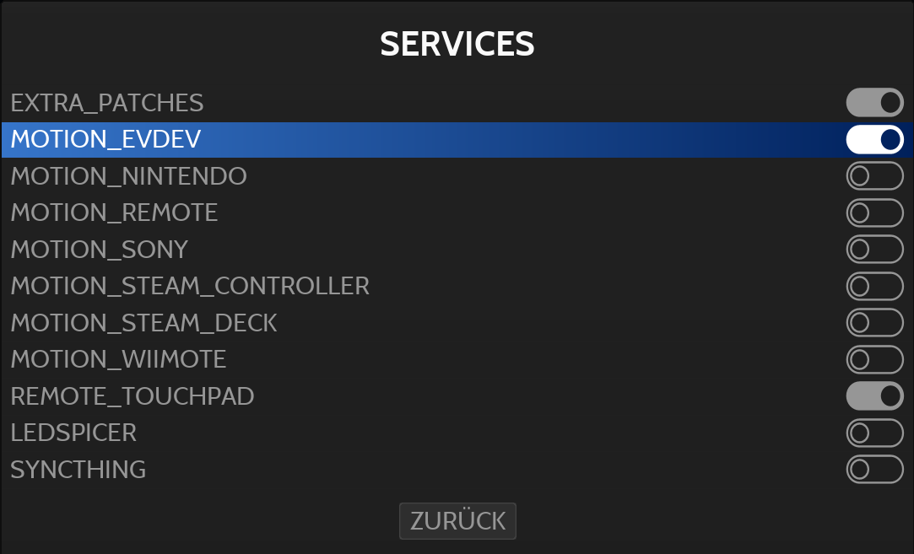

= batocera-extra
:url-batocera: https://github.com/batocera-linux/batocera.linux/
Extended motion and touch control for batocera
:toc: preamble
:toclevels: 4

This project is a proof of concept to play games with motion and touch control in the retro gaming distribution {url-batocera}[batocera].

## Project status

This project should be considered experimental. It demonstrates how motion and touch control can be added to batocera.
Installation requires command line access to batocera through a SSH shell.
Main goal of this project is to properly integrate the features into the core of batocera in the future.

The project is tested against the x86_64 platform. There are no hard dependencies on this architecture,
so it may well run on other architectures, too, but this is currently untested.

## Installation

. Open a shell on the batocera host
.. either via SSH
.. or by pressing F1 in the main menu to open the file manager and then F4 to open a terminal
. Copy this directory to `/userdata/extra` to your batocera host:
.. For the default version of batocera:
+
[source,console]
----
$ mkdir -p /userdata/extra && wget -O - https://github.com/git-developer/batocera-extra/tarball/main | gunzip | tar x --strip-components 1 -C /userdata/extra
----
.. For a specific version of batocera, replace `main` in the URL with the branch or tag for the target version. Example:
+
[source,console]
----
$ mkdir -p /userdata/extra && wget -O - https://github.com/git-developer/batocera-extra/tarball/batocera-38 | gunzip | tar x --strip-components 1 -C /userdata/extra
----
. Register the desired features as batocera service.
.. (Optional)
+
By default, all features are registered. If you'd like to shorten the list of available services, you can exclude a feature by running:
+
[source,console]
----
$ /userdata/extra/<feature>/service hide
----
.. Create services and activate patches (required for Cemu and Azahar):
+
[source,console]
----
$ /userdata/extra/bin/extra-services register
$ batocera-services enable extra_patches
$ batocera-services start extra_patches
----
. Enable the features you're interested according to section <<Configuration>>.

## Configuration
The configuration is applied by activating a motion service from the Main Menu / System Settings / Services:

[NOTE]
====
- The configuration has to be performed once only, it will be persisted across boots and batocera updates.

- Make sure that _EXTRA_PATCHES_ is enabled as batocera service.
The configuration generators for Cemu and Azahar in current batocera don't offer support for motion and touch control.
Thus, the included patches are required as batocera service.
====

Each time a service is started (manually or on boot), it will check for updates of the provider and download it to a cache directory if required, then install it and start it as background daemon.

Each time a motion service is started or stopped, the batocera configuration is updated so that Cemu and Azahar will read

* motion input from the first enabled motion provider (i.e. top-most in the Services menu) and
* touch input from the emulator window.

## Features
### Motion Providers

.Supported motion providers
|===
|Controller|Batocera Service|Comment|Connection|Motion Provider|UDP Port|Log file (in `/userdata/system/logs`)

|Devices with modern Linux drivers
|MOTION_EVDEV
|Recommended. Supports many devices incl. Nintendo and Sony controllers.
|USB, Bluetooth
|https://github.com/v1993/evdevhook2[evdevhook2]
| 26766
| `motion_evdev.log`

|Nintendo Switch Controllers
|MOTION_NINTENDO
| Supports Switch Pro Controllers and Joycons.
|USB, Bluetooth
|https://github.com/joaorb64/joycond-cemuhook[joycond-cemuhook]
| 26761
| `motion_nintendo.log`

|Sony Controllers
|MOTION_SONY
|Supports Sony DualShock 4 and DualSense 5.
|USB, Bluetooth
|https://github.com/lirannl/dsdrv-cemuhook[dsdrv-cemuhook]
| 26762
| `motion_sony.log`

|Steam Controller
|MOTION_STEAM_CONTROLLER
|Supports touch via link:motion_steam_controller/README.adoc[button mapping profiles]
|USB Dongle
|https://github.com/kozec/sc-controller[sc-controller]
| 26768
| `motion_steam_controller.log`

|Steam Deck
|MOTION_STEAM_DECK
|
|native
|https://github.com/kmicki/SteamDeckGyroDSU[SteamDeckGyroDSU]
| 26767
| `motion_steam_deck.log`

|Nintendo Wiimote
|MOTION_WIIMOTE
|Requires link:motion_wiimote/README.adoc[configuration]
|Bluetooth
|https://github.com/v1993/linuxmotehook2[linuxmotehook2]
| from configuration
| `motion_wiimote-PROFILE.log`

|Remote devices (e.g. smartphones)
|MOTION_REMOTE
|Requires link:motion_remote/README.adoc[configuration].
|HTTP
|any
| from configuration
| _none_

|===

To use a motion provider with an emulator other than Cemu or Azahar, configure the emulator to listen to `localhost` and the provider's UDP port. The https://github.com/joaorb64/joycond-cemuhook/wiki[joycond-cemuhook wiki] has detailed explanations for popular emulators.

#### Implementation details

Whenever a motion provider is started or stopped, the following settings are written to the batocera configuration file:

./userdata/system/batocera.conf
----
3ds.azahar_motion_device=engine:cemuhookudp
3ds.azahar_touch_device=engine:emu_window
3ds.azahar_udp_input_address=<provider-host>
3ds.azahar_udp_input_port=<provider-port>

wiiu.cemu_touchpad=1
wiiu.cemuhook_server_ip=<provider-host>
wiiu.cemuhook_server_port=<provider-port>
----

The host is `localhost` unless you run a remote provider (e.g. on a smartphone). The port is read from the first enabled service.

### Touch Providers
.Supported touch providers
|===
|Controller|Batocera Service|Comment|Touch Provider|Log file (in `/userdata/system/logs`)

|Local devices (e.g. mouse)
|_none_
|No configuration required.
|_none_
|_none_

|Sony controllers (DS4, DS5)
|_none_
|No configuration required.
|_none_
|_none_

|Steam Controller
|MOTION_STEAM_CONTROLLER
|link:motion_steam_controller/README.adoc[Configuration] is optional.
|https://github.com/kozec/sc-controller[sc-controller]
| `motion_steam_controller.log`

|Remote devices (e.g. smartphones)
|REMOTE_TOUCHPAD
|Requires link:remote_touchpad/README.adoc[configuration] to support browsers via URL or QR code.
|https://github.com/Unrud/remote-touchpad/[remote-touchpad]
| `remote_touchpad.log`

|===

### Scripts
Scripts are located in the `bin/` directory. They are optional and not related to touch and motion control.

#### `extra-services`
* Script to manage the features of this project.
  This script is required only once to register the features as batocera services.
  It may be useful when something goes wrong.

#### `on-game-condition`
* A template for files in the `/userdata/system/scripts` directory.

#### `read-temperatures`
* A script to read system temperatures.

#### `squash-mount`
* A script to simplify (un)mounting squashfs roms for one or all systems to subdirectories of `/var/run/squashfs`.

#### `system-summary`
* A script to create a system summary (cpu, memory). May be bound to a key or controller button, e.g.:
+
./userdata/system/configs/multimedia_keys.conf
[source.conf]
----
KEY_F12 1 /userdata/extra/bin/system-summary | sed 's/°/ /' | HOME=/userdata/system XAUTHORITY=/var/lib/.Xauthority DISPLAY=:0.0 osd_cat -f -*-*-bold-*-*-*-38-120-*-*-*-*-*-* -cred -s 3 -d 4
----

## Troubleshooting
> "Everything is installed and configured, but I have no motion. How can I find out what's wrong?"

* If something went wrong, you can reset the motion configuration:
+
  .. Enter the Services menu (Main Menu / System Settings / Services)
  .. Disable all motion services
  .. Leave the Services menu
  .. Enter the Services menu
  .. Enable the motion service of your choice
  .. Leave the Services menu
+
If motion control still doesn't work after reset, try one of the following commands in a terminal (via SSH or File Manager).

* `batocera-services list` lists each Batocera service and shows whether it's enabled.
+
.Example: List all Batocera services
----
# batocera-services list
extra_patches *
motion_evdev *
motion_nintendo -
motion_remote -
motion_sony -
motion_steam_controller -
motion_steam_deck -
motion_wiimote -
remote_touchpad *
ledspicer  -
syncthing  -
----

* `extra-services status` lists all running batocera-extra services.
+
.Example: List running batocera-extra services
----
# /userdata/extra/bin/extra-services status
Service                 PID     Name                    Port    Comment
motion_evdev            2801    evdevhook2              26766
motion_evdev            2807    evdevhook2
----

* Each batocera-extra service has its own log file, possibly containing error messages.
+
.Example: Show log file of `extra_patches`
----
# cat ~/logs/extra_patches.log
Installing archlinux package patch in revision 2025-02-03
Using locally cached file /userdata/system/.cache/arch-packages/patch-2.7.6-10-x86_64.pkg.tar.zst
Installing package from /userdata/system/.cache/arch-packages/patch-2.7.6-10-x86_64.pkg.tar.zst
patching file /usr/lib/python3.12/site-packages/configgen/generators/cemu/cemuControllers.py
patching file /usr/lib/python3.12/site-packages/configgen/generators/cemu/cemuControllers.py
Cemu Generator was patched for cemuhook.
patching file /usr/lib/python3.12/site-packages/configgen/generators/azahar/azaharGenerator.py
Azahar Generator was patched for cemuhook.
----
+
.Example: Show log file of `motion_evdev`
----
# cat ~/logs/motion_evdev.log
Using up-to-date local file /userdata/system/.cache/evdevhook2/evdevhook2-v1.0.1-x86_64.AppImage
Installing archlinux package upower in revision 2023-08-03 from repo extra
Using locally cached file /userdata/system/.cache/arch-packages/upower-1.90.2-1-x86_64.pkg.tar.zst
Installing package from /userdata/system/.cache/arch-packages/upower-1.90.2-1-x86_64.pkg.tar.zst
Installing archlinux package libimobiledevice in revision 2023-08-03 from repo extra
Using locally cached file /userdata/system/.cache/arch-packages/libimobiledevice-1.3.0-9-x86_64.pkg.tar.zst
Installing package from /userdata/system/.cache/arch-packages/libimobiledevice-1.3.0-9-x86_64.pkg.tar.zst
Installing archlinux package libplist in revision 2023-08-03 from repo extra
Using locally cached file /userdata/system/.cache/arch-packages/libplist-2.3.0-2-x86_64.pkg.tar.zst
Installing package from /userdata/system/.cache/arch-packages/libplist-2.3.0-2-x86_64.pkg.tar.zst
Installing archlinux package openssl in revision 2023-08-03
Using locally cached file /userdata/system/.cache/arch-packages/openssl-3.1.2-1-x86_64.pkg.tar.zst
Installing package from /userdata/system/.cache/arch-packages/openssl-3.1.2-1-x86_64.pkg.tar.zst
Installing archlinux package libusbmuxd in revision 2023-08-03 from repo extra
Using locally cached file /userdata/system/.cache/arch-packages/libusbmuxd-2.0.2-3-x86_64.pkg.tar.zst
Installing package from /userdata/system/.cache/arch-packages/libusbmuxd-2.0.2-3-x86_64.pkg.tar.zst
Marked dbus-python==1.2.18 as installed.
Found device Sony Computer Entertainment Wireless Controller Motion Sensors (unique identifier '84:17:66:61:8e:e3') - connecting... done!
----

* The Batocera configuration should contain the port of the enabled motion service.
+
.Example: Show motion port in Batocera configuration
----
# grep cemuhook ~/batocera.conf
3ds.azahar_motion_device=engine:cemuhookudp
wiiu.cemuhook_server_ip=localhost
wiiu.cemuhook_server_port=26766 // <1>
----
<1> Motion Port

* When motion is enabled and Cemu was started at least once, the Cemu controller config should contain the motion port:
+
.Example: Cemu controller configuration
----
# cat ~/configs/cemu/controllerProfiles/controller0.xml
<?xml version='1.0' encoding='UTF-8'?>
<emulated_controller>
<type>Wii U GamePad</type>
<controller>
   <api>SDLController</api>
   <uuid>0_030000004c050000c405000011810000</uuid>
   <display_name>Sony Computer Entertainment Wireless Controller</display_name>
   <rumble>0</rumble>
   <axis>
      <deadzone>0.25</deadzone>
      <range>1</range>
   </axis>
   <rotation>
      <deadzone>0.25</deadzone>
      <range>1</range>
   </rotation>
   <trigger>
      <deadzone>0.25</deadzone>
      <range>1</range>
   </trigger>
   <mappings>
      <entry>
      <mapping>1</mapping>
      <button>1</button>
      </entry>
      ...
   </mappings>
</controller>
<controller> // <1>
   <api>DSUController</api>
   <uuid>0</uuid>
   <motion>true</motion>
   <ip>localhost</ip>
   <port>26766</port> // <2>
</controller>
----
<1> `controller` element for motion configuration
<2> Motion Port
